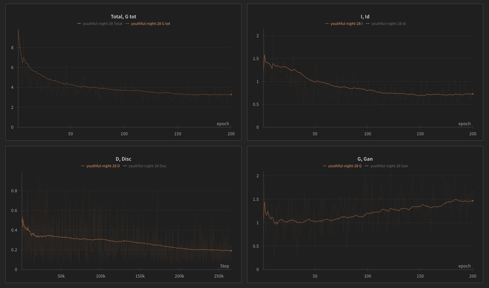

# cyclegan
A PyTorch implementation of [Unpaired Image-to-Image Translation using Cycle-Consistent Adversarial Networks](https://arxiv.org/pdf/1703.10593)


 
### Installation
```
git clone https://github.com/andregaio/cyclegan.git
cd cyclegan
conda create -n cyclegan python=3.9
conda activate cyclegan
pip install -r requirements.txt
```
### Models
 - CycleGAN

### Dataset
- [horse2zebra](https://www.kaggle.com/datasets/balraj98/horse2zebra-dataset)

### Training
```
python uda/train.py
```

### [Results](https://wandb.ai/andregaio/uda)
<div align="center">

#### Debug sample: Source -> Fake Target


#### Logs

</div>
